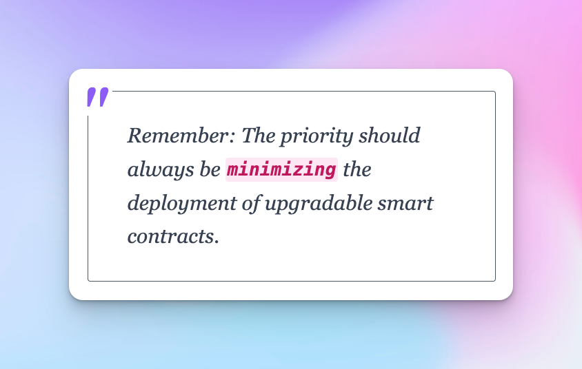
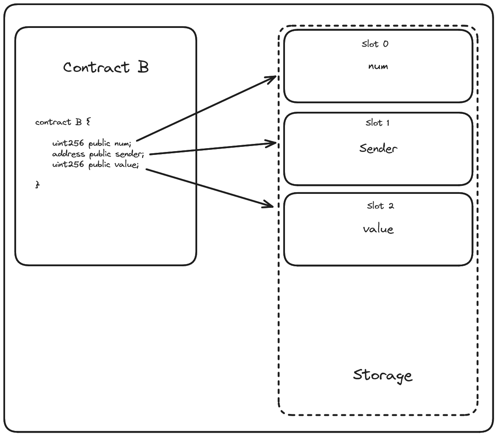

# Upgradable Smart Contracts


If you asked for real-life examples of where the potential downsides of upgradable smart contracts have manifested, it's safe to say we've got plenty. From hacks to lost funds, the risks are real.

This is where the immutable nature of smart contracts comes in - a feature that developers cherish since it implies that once a contract is deployed, nobody can modify or tamper with it. Interesting enough, the unchangeable aspect can become a pain if we want to upgrade a contract to perform new functions or squash a bug.

The exciting thing is, though the code deployed to an address is immutable, there's still room for change. In fact, smart contracts update all the time. Think token transfers or any functionality really—they frequently update their balances or variables. In other words, while the logic remains unchangeable, the contracts aren't as static as they seem.

## Upgrading Your Smart Contracts: A Guided Approach
So, if upgrading smart contracts tampers with their essential immutability, how can we approach the situation more wisely? Let's look at three different patterns or philosophies we can use:

1. Not really upgrading

2. Social migration

3. Proxy (with subcategories like metamorphic contracts, transparent upgradable proxies, and universal upgradable proxies)

### Not Really Upgrading
The "Not Really Upgrading" method is the simplest form of "upgrading" a smart contract. The idea here is parameterizing everything—the logic we've deployed is there and that's what users interact with. This involves having setter functions that can change certain parameters.

For instance, if you have a set reward that distributes a token at a 1% rate every year, you can have a setter function to adjust that distribution rate. While it's easy to implement, it has limitations: unless you anticipated all possible future functionality when writing the contract, you won't be able to add it in the future.

Another question that arises is—who gets access to these functions? If a single person holds the key, it becomes a centralized smart contract, going against decentralization's core principle. To address this, you can add a governance contract to your protocol, allowing proportional control.

### Social Migration

In line with maintaining the immutability of smart contracts, another method is social migration. It involves deploying a new contract and socially agreeing to consider the new contract as the 'real' one.

It has some significant advantages, the main being the adherence to the essential immutability principle of smart contracts. With no built-in upgradeability, the contract will function the same way, whether invoked now or in 50,000 years. But one major disadvantage is that you'd now have a new contract address for an already existing token. This would require every exchange listing your token to update to this new contract address.

Moving the state of the first contract to the second one is also a challenging task. You need to devise a migration method to transport the storage from one contract to the other. You can learn more about the social migration method from [this blog post](https://blog.trailofbits.com/2018/09/05/contract-upgrade-anti-patterns/) written by Trail of Bits.

### Proxies
Finally, let's talk about proxies, the holy grail of smart contract upgrades. Proxies allow for state continuity and logical updates while maintaining the same contract address. Users may interact with contracts through proxies without ever realizing anything changed behind the scenes.

There are a ton of proxy methodologies, but three are worth discussing here: Transparent Proxies, Universal Upgradable Proxies (UPS), and the Diamond Pattern. Each has its benefits and drawbacks, but the focus is on maintaining contract functionality and decentralization.

---

## EIP-1967 Proxy And Delegate Call
Demo [CodeBase](https://github.com/AkshatOdiya/foundry-upgradable-smart-contracts/tree/main/src/sublesson)

This `SmallProxy` example contains a lot of Yul. Yul is a sort of in-line Assembly that allows you to write really low-level code. Like anything low-level it comes with increased risk and severity of mistakes, it's good to avoid using Yul as often as you can justify.

For more information on `Yul`, check out the [Yul Documentation](https://docs.soliditylang.org/en/latest/yul.html).

Now, within `SmallProxy` we're importing Proxy.sol from our good friends OpenZeppelin. Looking at the code, we can get a better idea of how things are actually being handled.

`Proxy.sol` There are really only 2 functions in this contract (ignoring the virtual _implementation function). We have _delegate, fallback/_fallback. The fallback functions simply route unrecognized call data to the _delegate function which then routes the call to an implementation contract.

[Ethereum Improvement Proposal (now ERC)-1967](https://eips.ethereum.org/EIPS/eip-1967)

The need to regularly utilize storage to reference things in implementation (specifically the implementation address) led to the desire for EIP-1967: Standard Proxy Storage Slots. This proposal would allocate standardized slots in storage specifically for use by proxies.

#### Playing with SmallProxy.sol
 The first thing we'll need to do is call the setImplementation function on our SmallProxy contract, passing the address of ImplementationA. This is how the proxy knows where to delegate calls.

 

 By passing an argument to `getDataToTransact` we're provided the encoded call data necessary to set our `valueAtStorageSlotZero` to `777`. Remember, sending a transaction to our proxy with this call data should update the storage in the proxy.

>❗ **_NOTE_**
Because SmallProxy.sol doesn't have a function of it's own which matches the call data's function selector, the fallback function will be engaged. This in turn routes the call data to our delegate function, delegating the call to ImplementationA.

To see this in action, we just need to paste our `getDataToTransact` return value into the CALLDATA field and hit `Transact`


`valueAtStorageSlotZero` has been updated on our proxy contract!

#### Upgrading SmallProxy.sol

Now, let's demonstrate how upgrading this protocol would work. Add another contract to SmallProxy.sol:

Next, deploy ImplementationB and then call setImplementation on SmallProxy, passing this new implementation address.

Just like before, we can use `getDataToTransact` to determine our necessary call data. By passing the same call data, pertaining to the argument `777` we can see ...  

  

`valueAtStorageSlotZero` now reflects the new implementation logic of `newValue + 2`!


#### Selector Clashes
In our example here, SmallProxy.sol only really has one function setImplementation, but if the implementation contract also had a function called setImplementation, it would be easy to see how this conflict could occur. Were this the case, it would be impossible to call the setImplementation function contained by the Implementation contract, because it would always be processed by the proxy.

### Delegate Call
At it's core delegateCall is going to be similar to the call function 

Contract B is very simple, it contains 3 storage variables which are set by the setVars function.

If we recall, storage acts kind of like an array and each storage variable is sequentially assigned a slot in storage, in the order in which the variable is declared in a contract.

  

Now consider Contract A

In contract A we're doing much the same thing, the biggest different of course being that we're using delegateCall.

This works fundamentally similar to call. In the case of call we would be calling the setVars function on Contract B and this would update the storage on Contract B, as you would expect.

With delegateCall however, we're borrowing the logic from Contract B and referencing the storage of Contract A. This is entirely independent of what the variables are actually named.

  

**Practical Demo**

Once the code has been pasted into Remix, we should be able to compile and begin with deploying Contract B. We can see that all of our storage variables begin empty.

    

By calling setVars and passing an argument, we can see how the storage variables within Contract B are updated as we've come to expect.  

   

Now we can deploy Contract A. This contract should default to empty storage variables as well. When we call `setVars` on Contract A however, it's going to borrow the setVars logic from Contract B and we'll see it update it's own storage, rather than Contract B's.

>❗ NOTE
We'll need to pass Contract B as an input parameter to Contract A's setVars function so it knows where to delegate to!

   

Importantly, this behaviour, due to referencing storage slots directly, is independent of any naming conventions used for the variables themselves.

   

In fact, if Contract A didn't have any of it's own declared variables at all, the appropriate storage slots would *still* be updated!

Now, this is where things get really interesting. What if we changed the variable type of `number` in Contract A to a `bool`? If we then call delegateCall on Contract B, we'll see it's set our storage slot to `true`. The bool type detects our input as `true`, with `0` being the only acceptable input for false 

   


* **Reference:** [Solidity By Example](https://solidity-by-example.org/delegatecall/)

---

## UUPS

Employing UUPS, **all of the upgradeability logic is going to be contained within this BoxV1** implementation contract.

BoxV1 is going to be very simple, we'll have two functions, one which returns a number, and another which returns protocol version.

BoxV2.sol which is upgraded version of BoxV1 with updated version number, and function to set the number.

In BoxV1, We will receive error saying "BoxV1 should be marked abstract" because we don't have all the necessary functions defined in BoxV1 as required by UUPSUpgradeable which is an abstract contract.

**_Important_**
Abstract contracts have some of their functions defined, and others undefined. These contracts expect their child classes to implement the undefined functions.

An example of an undefined function within `UUPSUpgradeable` would be `_authorizeUpgrade`.

### Storage Gaps

In older implementations of UUPSUpgradeable, you may see a line that I wanted to draw special attention to.

```solidity
/*
 * @dev This empty reserved space is put in place to allow future versions to add new variables without shifting down storage in the inheritance chain.
 * See https://docs.openzeppelin.com/contracts/4.x/upgradeable#storage_gaps
 */
uint256[50] private __gap;
```

   

Recall that, when values are assigned by a function, the variable name doesn't ultimately matter as the value is assigned to a storage slot. We saw that storage clashes were possible when an upgraded implementation contract made changes to the order of storage variable assignments, leading to some funky behaviours.

Storage gaps are an effort to get ahead of this problem by pre-allocating an array of slots to account for future protocol changes. This effectively creates a buffer of available storage slots to be used by subsequent implementation contracts for new variables and functionality.

### Why we need Initializable Contract Imported?

Because storage for a proxied protocol is stored in the proxy, any initial set up needs to be done after an implementation contract's deployment. This is handled through this initializer functionality. Any setup that would be handled in a constructor, on deployment of an implementation contract, won't have those storage values passed to the proxy as necessary.

This is such a concern that common practice is to include a constructor within an implementation contract which explicitly disables initialization functions, assuring that this needs to be done through the proxy.

```solidity
constructor() {
    _disableInitializers();
}
```
If we add this to our BoxV1, we'll then need to add initialization logic to it as well.
```solidity
function initialize() public initializer {}
```
It's within this initialize function that we would include the logic that we would normally have within a constructor. If we wanted our BoxV1 protocol to be ownable, for example, we would import OwnableUpgradeable and Initializable and then define the above functions like so

Common convention is to prepend initializer functions with a double-underscore `__`.

`initializer` is a modifier applied to an implementation contracts initialize function which ensures it can only be called once.

We can give BoxV2 the same treatment.

### Conclusion

* Proxied implementation contracts don't use constructors

Constructors, by their nature, initialize storage variables on a contract on deployment. Storage needs to be tracked on the proxy contract in an upgradeable protocol and for this reason constructors aren't used.

* Initializer functions are used instead of constructors

In lieu of constructors, the initialization design pattern is used whereby initializer functions are added to the implementation contract and called via the proxy contract post deployment.

### Practical Demo

It's time to see this in action.
1. Deploy BoxV1

2. Get an address

3. Deploy Proxy with BoxV1 address

4. Verify that everything works

4. Deploy BoxV2

5. Point Proxy to BoxV2

There are two scripts, `script/DeployBox.s.sol` and `script/UpgradeBox.s.sol`

The proxy used is `ERC1967`.
Read more about its specifics in the [OpenZeppelin Documentation](https://docs.openzeppelin.com/contracts/4.x/api/proxy) or [Ethereum Improvement Proposals](https://eips.ethereum.org/EIPS/eip-1967).